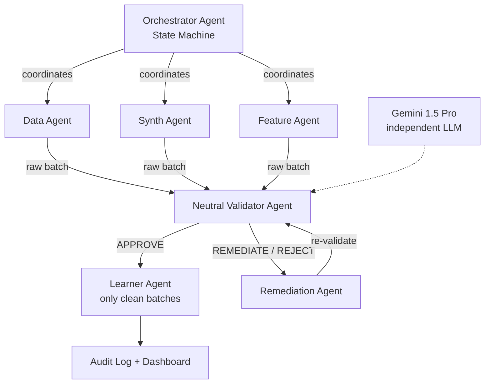

# FairLoop — In-Loop Bias Prevention System

> **Every other team builds a bias detector. FairLoop builds a bias firewall.**

[](https://developers.google.com/community/gdsc-solution-challenge)
[](https://opensource.org/licenses/MIT)
[](https://www.python.org/downloads/)

FairLoop is an open-source, **hyperagent-powered** bias prevention system that embeds a **Neutral Validator Agent** directly inside the AI model training loop — catching, auditing, and correcting biased training data **before** it ever reaches the learning model.

## Key Results

Tested on the UCI Adult Income dataset (32,561 records):

| Metric | Baseline (No FairLoop) | With FairLoop | Change |
|--------|----------------------|---------------|--------|
| **Disparate Impact Ratio** | 0.606 | **0.887** | +46% improvement |
| **Demographic Parity Diff** | -0.036 | **-0.017** | 53% closer to fair |
| **Equal Opportunity Diff** | -0.091 | **0.099** | Within threshold |
| **Accuracy** | 80.64% | **80.25%** | Only 0.4% cost |

> Disparate Impact Ratio improved from **0.606 → 0.887**, crossing the **0.80 (80% rule) threshold** required by EEOC guidelines — with only **0.4% accuracy cost**.

## Architecture



### Agent Network

| Agent | Role | Technology |
|-------|------|------------|
| **Orchestrator** | Coordinates all agents, manages training loop state | LangGraph / Python |
| **Data Agent** | Ingests data, validates schema, chunks into batches | HuggingFace Datasets |
| **Synth Agent** | Generates balanced synthetic samples for underrepresented groups | SDV / Statistical Resampling |
| **Feature Agent** | Transforms features, detects proxy variables | scikit-learn |
| **Validator Agent** | Independent fairness auditor (statistical + semantic) | Custom + Gemini 1.5 Pro |
| **Remediation Agent** | Repairs biased batches via 5-strategy hierarchy | AIF360 Reweighing + Custom |
| **Learner Agent** | Trains only on validated batches | LogisticRegression / LoRA |

## Quick Start

### 1. Install

```bash
git clone https://github.com/your-username/fairloop.git
cd fairloop
pip install -r requirements.txt
```

### 2. Run the Demo

```bash
# Quick comparison: Baseline vs FairLoop (5 iterations each)
python main.py demo

# Full pipeline (20 iterations)
python main.py run --iterations 20

# Train WITHOUT FairLoop (biased baseline)
python main.py baseline
```

### 3. Start the Dashboard

```bash
# Start API server
python main.py server

# Open dashboard/index.html in your browser
# The dashboard connects to http://localhost:8000
```

### 4. Docker (production)

```bash
docker-compose up
# API: http://localhost:8000
# Dashboard: http://localhost:3000
```

## Fairness Metrics

FairLoop evaluates every batch against **7 statistical metrics**:

| # | Metric | Threshold | Description |
|---|--------|-----------|-------------|
| 1 | **Demographic Parity Difference** | ≤ 0.10 | Outcome rate gap between groups |
| 2 | **Disparate Impact Ratio** | ≥ 0.80 | EEOC 80% rule — ratio of positive outcomes |
| 3 | **Equal Opportunity Difference** | ≤ 0.10 | True positive rate gap |
| 4 | **Predictive Parity Difference** | ≤ 0.10 | Precision gap across groups |
| 5 | **Individual Fairness Score** | ≥ 0.85 | Similar inputs → similar outcomes |
| 6 | **Representation Balance** | ≥ 0.75 | Minority group representation |
| 7 | **Proxy Variable Detection** | r < 0.60 | Flags correlated columns (zip code, etc.) |

Plus an optional **semantic layer** via Gemini 1.5 Pro for detecting stereotyped language and coded bias.

## Remediation Strategies

When a batch is flagged, the Remediation Agent applies strategies in order:

1. **Re-weighting** — Kamiran & Calders (2012) algorithm to equalize outcome rates
2. **Disparate Impact Removal** — Repair feature distributions toward group-conditional medians
3. **Counterfactual Augmentation** — Flip protected attributes to generate balanced samples
4. **Synthetic Infill** — Generate targeted synthetic data for underrepresented groups
5. **Balanced Resampling** — Oversample minority groups to match majority

Max **2 remediation cycles per batch** to prevent infinite loops.

## Audit Log & Compliance

Every Validator decision is logged immutably:

```json
{
  "iteration": 5,
  "batch_id": "batch_abc123",
  "verdict": "REMEDIATE",
  "metrics": {
    "disparate_impact_ratio": 0.397,
    "demographic_parity_diff": -0.188
  },
  "reason": "DI ratio 0.397 below 0.80 threshold",
  "remediation_applied": "reweighting + synthetic_infill",
  "final_verdict": "APPROVE"
}
```

Export compliance reports for:
- **EU AI Act** (Article 10 — Data Governance)
- **US EEOC** Uniform Guidelines on Employee Selection (80% rule)
- **IEEE 7010-2020** (Well-being Impact Assessment)

## Live Dashboard

The React + Recharts dashboard shows:
- **Fairness Metrics Over Time** — DI ratio trending toward 0.80+
- **Verdict Distribution** — Approve/Remediate/Reject pie chart
- **Model Performance** — Accuracy + loss curves
- **Audit Log** — Real-time batch decisions with verdict badges

## API Reference

| Endpoint | Method | Description |
|----------|--------|-------------|
| `POST /pipeline/start` | Start pipeline | Configure and launch FairLoop |
| `GET /pipeline/status` | Pipeline status | Current state, metrics, verdicts |
| `GET /pipeline/metrics` | Training metrics | Full metrics history |
| `GET /audit/entries` | Audit log | Filterable decision history |
| `GET /audit/summary` | Audit summary | Aggregate statistics |
| `GET /audit/compliance-report` | Compliance | Full regulatory report |
| `WS /ws` | WebSocket | Live event stream |

## Project Structure

```
fairloop/
├── agents/
│   ├── orchestrator.py      # Central coordinator (LangGraph state machine)
│   ├── data_agent.py        # Data ingestion + batching
│   ├── synth_agent.py       # Synthetic data generation
│   ├── feature_agent.py     # Feature engineering + proxy detection
│   ├── validator_agent.py   # Neutral Validator (statistical + semantic)
│   ├── remediation_agent.py # 5-strategy bias repair
│   └── learner_agent.py     # Model training (sklearn / LoRA)
├── core/
│   ├── config.py            # Central configuration
│   ├── fairness_metrics.py  # 7 fairness metrics engine
│   └── audit_log.py         # Immutable SQLite audit log
├── api/
│   └── main.py              # FastAPI backend
├── dashboard/
│   └── index.html           # React + Recharts live dashboard
├── tests/
│   ├── test_metrics.py      # Fairness metrics tests
│   └── test_validator.py    # Validator agent tests
├── main.py                  # CLI entry point
├── requirements.txt
├── Dockerfile
├── docker-compose.yml
└── .env.example
```

## Key Design Decisions

### Why a Separate LLM for Validation?
If the Validator shared weights with the Learner, it would inherit the same biases it is supposed to catch — circular failure. Using Gemini as an independent validator ensures structural independence. Like financial auditing: the auditor cannot be employed by the entity they audit.

### Why In-Loop, Not Post-Hoc?
Post-hoc debiasing is a patch — it constrains output while bias stays in the weights. In-loop prevention ensures the model **never learns biased patterns**, producing structural fairness, not superficial.

### Why Multi-Agent?
Each agent has one well-defined responsibility — auditable, replaceable, extensible. Swap the Remediation Agent's strategies independently. Tune the Validator's thresholds per domain.

## References

- Bellamy et al. (2019) — [AI Fairness 360](https://arxiv.org/abs/1810.01943)
- Kamiran & Calders (2012) — Reweighing Algorithm
- Caton & Haas (2020) — [Fairness in ML Survey](https://arxiv.org/abs/2010.04053)
- EEOC Uniform Guidelines (1978) — 80% Rule
- EU AI Act (2024) — Article 10: Data Governance

## License

MIT License — see [LICENSE](LICENSE) for details.

---

**Google Solution Challenge 2026 — Unbiased AI Decision Track**

*Ensuring Fairness and Detecting Bias in Automated Decisions*
